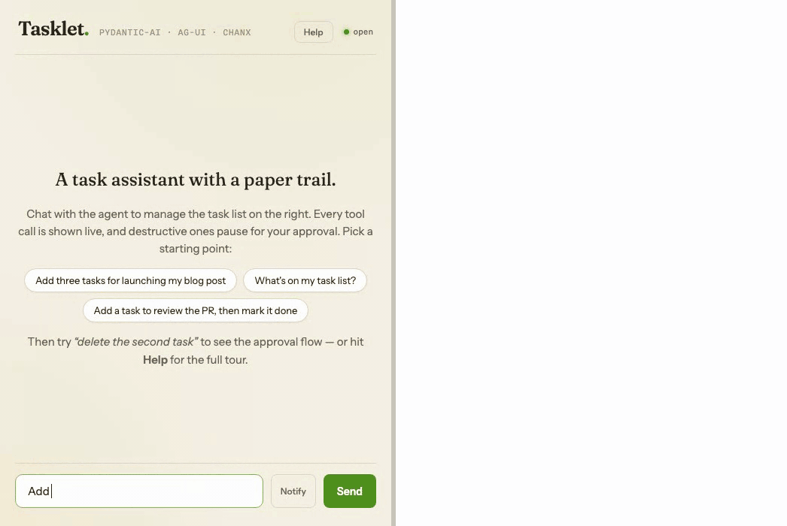

# Pydantic AI over AG-UI on a WebSocket

A production-style AI agent server built with [Pydantic AI](https://ai.pydantic.dev),
FastAPI and [chanx](https://github.com/huynguyengl99/chanx), speaking the
[AG-UI protocol](https://ag-ui.com) over a WebSocket — plus a React client built on
AG-UI's own published types.



*Two tabs, one run. The left tab asks; the run pauses on a destructive tool; the
right tab — which never typed anything — approves it, and both tabs watch the run
finish.*

> **Looking for the version from the blog post?** That one invented its own typed
> protocol and generated TypeScript from an AsyncAPI schema. It is tagged
> [`v1`](https://github.com/huynguyengl99/pydantic-ai-ws-agent/tree/v1) and still
> works. This is what happened when the same demo was rebuilt on a standard protocol
> instead: `server/app/assistant/` went from 887 lines to 246.

The demo agent ("Tasklet") manages a task list and shows:

- **Streaming over AG-UI** — text, tool calls and shared state arrive as the protocol's
  own events, so an AG-UI frontend works against this without translation
- **Human-in-the-loop approvals, with no protocol of our own** — destructive tools are
  declared `requires_approval=True`; the run pauses, `RUN_FINISHED` carries an
  [interrupt](https://docs.ag-ui.com/concepts/interrupts) describing the tool call and
  the answer it expects, and any tab resumes it by naming that interrupt
- **A conversation that stays on the server** — AG-UI normally has the client resend
  the whole message list; here `messages` carries only the new turn, which is why a
  resumed approval works with `"messages": []`
- **Every tab on one run** — runs broadcast to a per-thread channel-layer group, each
  event carrying a sequence number, and a tab that connects mid-run is replayed the run
  so far before it sees anything live. Refresh mid-answer and it keeps going. The run
  opens by echoing the prompt as `role: "user"` text events, so a tab that did not send
  it still shows the question rather than an answer to nothing
- **Shared state** — the task list travels as `STATE_SNAPSHOT`, sent on connect and
  again with every run, including runs that fail part-way through
- **A real paper trail** — reloading replays the conversation as `MESSAGES_SNAPSHOT`:
  the same prompts, tool cards and answers, dumped from stored pydantic-ai messages by
  the adapter that writes the live stream
- **Follow-up suggestions** — 3 chip-sized next prompts ride a `CUSTOM` event, are
  persisted, and come back on reload. Generated by a second cheap call rather than a
  field on the answer, so the reply still streams as text
- **Broadcast from anywhere** — `POST /conversations/{id}/notify` reaches every client
  on a conversation from plain HTTP, and a `schedule_reminder` tool has a background
  job notify back later. Neither holds a socket
- **Components, not framework** — the WebSocket layer is three
  [chanx-kit](https://github.com/huynguyengl99/chanx-kit) kits copied into the repo
  with [copit](https://github.com/huynguyengl99/copit), so the code is readable and
  editable in `server/app/ws_kits/`
- **Tested without a model, and in a browser** — the whole flow runs against
  `FunctionModel` (no API key, no flakiness), and Playwright drives approvals, two
  tabs and toasts in Chromium

## How it works

- **[docs/architecture.md](docs/architecture.md)** — the agent, the topic that replaced
  a 352-line harness, where the conversation lives, and how broadcast and replay work
- **[docs/protocol.md](docs/protocol.md)** — the two chanx messages that carry AG-UI,
  the envelope's `seq`, and sequence diagrams for a turn, an approval and a notification

## Run it

Server (Python 3.11+, [uv](https://docs.astral.sh/uv/)):

```bash
cd server
cp .env.example .env   # add OPENAI_API_KEY (or ANTHROPIC_API_KEY / AGENT_MODEL)
uv sync
uv run uvicorn app.main:app --port 8000
```

Without an API key the server falls back to pydantic-ai's built-in `test` model, so
everything still runs — the answers are just synthetic.

There is no migration tooling: if the SQLite schema changes between versions, delete
the local database (`rm server/tasklet.db`) and let the server recreate it.

Web:

```bash
cd web
pnpm install
pnpm dev    # http://localhost:5173
```

Then try the flow (the in-app **Help** button walks through it too):

1. *"Add three tasks for launching my blog post"* — watch the tool cards and the task
   panel fill in
2. *"Mark the first one as done"*
3. *"Delete the second task"* — the run pauses with an approval card; approve or deny
4. Open a second tab: both stream the same run, and either can approve
5. **+ New chat** — a fresh conversation with its own task list; switch between them
   in the sidebar
6. Push a notification with the **Notify** button, or from plain HTTP:
   `curl -X POST localhost:8000/conversations/<id>/notify -H 'Content-Type: application/json' -d '{"title":"Hi","body":"from curl"}'`
7. *"Remind me in 15 seconds to stretch"* — a background job notifies back

AsyncAPI docs for the WebSocket channel: <http://localhost:8000/asyncapi>.

## Updating the kits

The WebSocket components are copied in, and `server/copit.toml` records the commit
they came from, so they can be updated rather than drifting:

```bash
cd server
uvx copit update-all
```

## Scaling out with Redis

The demo defaults to an in-memory channel layer (single process). To broadcast across
instances, start Redis and point the server at it:

```bash
docker compose up -d redis

cd server
REDIS_URL=redis://localhost:6379 uv run uvicorn app.main:app --port 8000
# in another terminal — a second instance, same conversations:
REDIS_URL=redis://localhost:6379 uv run uvicorn app.main:app --port 8001
```

Connect one browser tab to each instance, on the same conversation: both stream the
same run, and an approval on either resumes it.

One caveat worth knowing: mid-run **replay** is backed by an in-memory buffer in the
`ag-ui` kit, so a tab that joins mid-run is only replayed by the process running that
run. Everything else works across instances. A shared `RunEventStore` would close the
gap.

## Tests, lint & type checks

```bash
cd server
uv run pytest           # protocol, approvals, broadcast, persistence
uv run ruff check app tests && uv run ruff format --check app tests
uv run mypy app tests   # strict
uv run pyright          # strict

cd web
pnpm check              # eslint + prettier + tsc
pnpm e2e                # Playwright: starts both servers itself
```

`pnpm e2e` runs against a scripted model on its own database, so no API key is
needed and nothing depends on what a provider felt like saying.

## Layout

```
server/app/main.py               # FastAPI: /conversations, /notify, AsyncAPI docs
server/app/config.py             # typed settings (pydantic-settings), reads .env
server/app/db.py                 # SQLite: per-conversation tasks, transcript, titles
server/app/layers.py             # channel layer: in-memory default, Redis via REDIS_URL
server/app/ws.py                 # BaseConsumer: shared consumer defaults
server/app/assistant/            # the feature app
  agent.py                       #   Agent, per-conversation tools, approval-gated tools
  topic.py                       #   AG-UI topic: deps, task state, title
  store.py                       #   the kit's conversation store over SQLite
  consumer.py                    #   the consumer that mounts the topic
  notify.py                      #   notifications as AG-UI CUSTOM events
  reminders.py                   #   background jobs that notify back
server/app/ws_kits/              # copied chanx-kit components (owned, editable)
server/tests/e2e_app.py          # the app with a scripted model, for Playwright
web/src/lib/ws-client.ts         # chanx envelope + AG-UI, with seq ordering
web/src/lib/chat-state.ts        # AG-UI events -> UI state reducer
web/e2e/                         # Playwright specs
```
