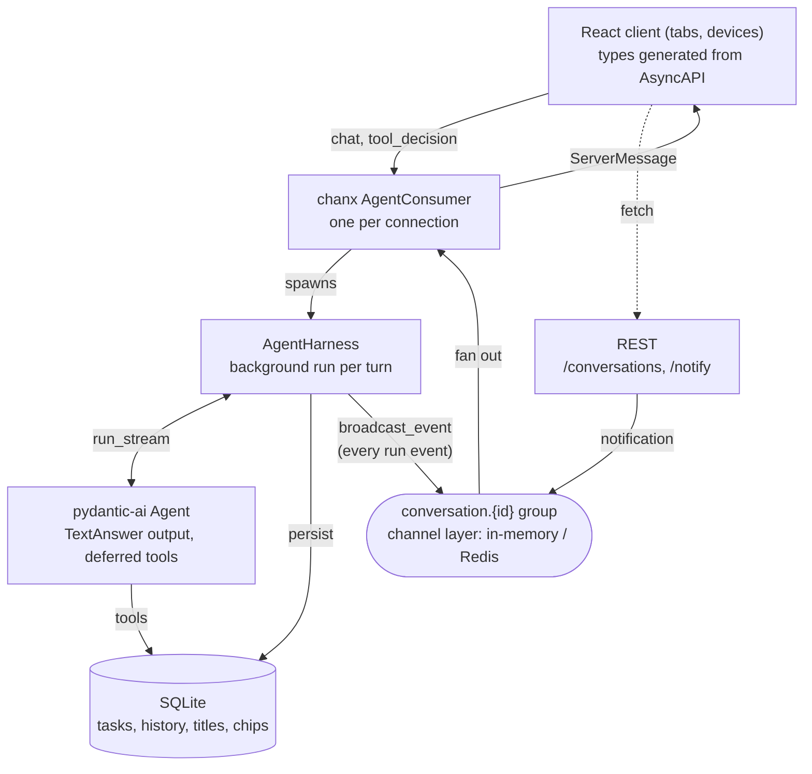

# Architecture

How a prompt becomes a stream of typed WebSocket messages, and how a destructive
tool call pauses for human approval.

The loop at the center is the whole idea: nothing is sent to "the socket that asked" —
the harness broadcasts every run event (the echo of the user's prompt, text deltas,
tool calls and results, approvals, `stream_end`, suggestion chips) into the
conversation group, and each consumer forwards it to its client. One tab or five,
same code path. The full event list lives in [protocol.md](protocol.md).

## The agent (`server/app/assistant/agent.py`)

A plain [pydantic-ai](https://pydantic.dev/docs/ai/) agent. Three things are worth noting:

1. **`output_type=[TextAnswer, DeferredToolRequests]`** — every run ends as either a
   structured answer (`content` + 3 `follow_ups` chips, produced in the same
   completion) or a request for permission. Destructive tools are declared with
   `@agent.tool(requires_approval=True)`; when the model calls one, the tool does
   *not* execute — the run ends early with a `DeferredToolRequests` listing the
   pending calls ([deferred tools docs](https://pydantic.dev/docs/ai/tools-toolsets/deferred-tools/)).
2. **Every task tool takes `RunContext[AgentDeps]`** and scopes its DB calls to
   `ctx.deps.conversation_id` — task lists are per conversation, and the same deps let
   `schedule_reminder` broadcast back into the right group later.
3. **`build_agent()` is a factory**, not a module-level singleton, so tests can build
   the same agent wired to a fake model (`FunctionModel`). Contextvar-based
   `Agent.override()` does not propagate into the consumer's task under the test
   communicator, so tests patch the consumer's agent instead.

Prompting gotcha: the instructions explicitly tell the model to call destructive tools
directly and **not** ask for confirmation in chat — the harness owns the approval UX.
Without that line, models tend to ask "are you sure? (yes/no)" in prose and bypass the
typed approval flow entirely.

## The harness (`server/app/assistant/harness.py`)

`AgentHarness.run()` drives `agent.run_stream()` and translates pydantic-ai's
streaming into protocol messages from two sources:

- **`stream_output(debounce_by=None)`** yields partially-validated `TextAnswer`
  snapshots; the harness diffs successive `content` values and sends the difference
  as `text_delta` — live token streaming out of a structured output.
- **`event_stream_handler`** receives the tool events fired while the graph runs.

| source                                       | WS message          |
| -------------------------------------------- | ------------------- |
| partial `TextAnswer.content` diff            | `text_delta`        |
| `FunctionToolCallEvent` (handler)            | `tool_call`         |
| `FunctionToolResultEvent` (handler)          | `tool_result`       |
| final `TextAnswer`                           | `stream_end`, then `suggestions` (its `follow_ups`) |
| `DeferredToolRequests` output                | `tool_call` per pending call (synthesized — `run_stream` stops eventing at the final result), then `approval_request` |

After every run (including paused ones) the full message history is persisted with
`result.all_messages_json()` and restored via `ModelMessagesTypeAdapter` on the next
turn — multi-turn context, reconnect replay, and resume-after-approval all come from
those two calls. The first run of a conversation also derives its title from the
prompt (used by the sidebar via `GET /conversations`).

`build_transcript()` turns that stored history back into the wire transcript: a
union of text items and tool items (`kind: "text" | "tool"`). Tool status is derived
from the persisted parts — a `ToolReturnPart` with `outcome="denied"` replays as
`denied`, a call with no return part as `awaiting` — so a reload shows the same
cards, in the same order, as the live stream did. The structured-output tool call
(`final_result`, carrying the `TextAnswer`) is special-cased: it replays as the
assistant's text, never as a tool card.

The harness never touches a socket. It is constructed with a `send` callable; the
consumer passes `broadcast_event` bound to the conversation group.

## Background runs and groups (`server/app/assistant/consumer.py`)

Runs are **not** awaited inside the chat handler. `handle_chat` spawns the run as an
asyncio task and returns immediately:

- A module-level `RUNNING` dict (keyed by conversation id) rejects concurrent runs
  with a typed `agent_error`.
- The task broadcasts every event to the group `conversation.{id}` via chanx's
  `broadcast_event` classmethod.
- Each consumer joins that group on connect. `passthrough_events` makes chanx generate
  the event handlers that forward group events to the client verbatim (and documents
  them in AsyncAPI).

Consequences, all covered by tests:

- **Refresh-proof**: the run keeps going with no socket attached; a reconnect replays
  the transcript (tool cards included), the latest follow-up chips (persisted with
  the conversation, cleared when the next run starts), and picks up live events. If
  an approval is still pending, the consumer re-sends the `approval_request` on
  connect so the new tab gets a working approval card, not a dead "awaiting" chip.
- **Multi-tab**: every connection in the group receives the identical stream.
- **Cross-connection approval**: pending `DeferredToolRequests` are stored in
  `PENDING_APPROVALS` keyed by conversation (not connection), so the `tool_decision`
  can arrive on any socket. (Store them in the database if they must survive restarts.)
- **Per-conversation everything**: the task snapshot sent on connect, the
  `tasks_updated` broadcasts, and the agent's tools all read the same conversation id
  — a new chat starts empty, and `DELETE /conversations/{id}` (in `main.py`) removes
  the history, the tasks, cancels an in-flight run, and drops pending approvals.
- **Broadcast from anywhere**: `POST /conversations/{id}/notify` (in `main.py`) pushes
  a typed `notification` from plain HTTP. Workers and cron jobs can do the same.
- **Background jobs that notify back**: the `schedule_reminder` tool
  (`server/app/assistant/reminders.py`) schedules an in-process job; when it fires —
  possibly long after the run ended — it broadcasts a `notification` into the group.
  The tool reads the conversation id from `RunContext[AgentDeps]`, which the harness
  passes as `deps` on every run. Swapping the in-process job for a real worker
  (ARQ, Celery) changes nothing but where the sleep happens.

## Configuration (`server/app/config.py`)

All configuration is a typed [pydantic-settings](https://docs.pydantic.dev/latest/concepts/pydantic_settings/)
`Settings` object, loaded from the environment and `server/.env` — no scattered
`os.environ.get` calls. Model resolution lives here too: explicit `AGENT_MODEL`
wins, otherwise the first configured provider key, otherwise pydantic-ai's `test`
model. Consumer-wide defaults (like chanx's `send_completion`) sit on a shared
`BaseConsumer` (`server/app/ws.py`) so new consumers inherit them.

## Channel layer (`server/app/layers.py`)

`InMemoryChannelLayer` by default — one process, zero dependencies. Setting
`REDIS_URL` switches to `RedisPubSubChannelLayer`, and the same group semantics work
across multiple server instances and worker processes (`docker compose up -d redis`,
then run two uvicorns — see the README).

## The contract and the generated client

chanx builds an AsyncAPI 3.0 schema from the consumer's `@ws_handler` /
`passthrough_events` declarations and serves it at `/asyncapi.json` (interactive docs
at `/asyncapi`).

`web/scripts/generate-types.mjs` fetches that schema, splits messages into
client-bound vs server-bound using the AsyncAPI *operations* (inputs vs replies), and
compiles them with `json-schema-to-typescript` into discriminated unions
(`ClientMessage`, `ServerMessage`). One deliberate fix: Pydantic marks `action` as
optional in JSON Schema (it has a default), but it is the discriminator — the script
forces it into `required` so TypeScript can narrow on it. Nested unions get the same
treatment for free by declaring their discriminator *without* a default in Pydantic
(see `TranscriptItem.kind` in `messages.py`).

On the client, `web/src/lib/chat-state.ts` is a single exhaustive `switch` over
`ServerMessage["action"]` — adding a server message without handling it is a compile
error after regeneration.

## Testing (`server/tests/`)

The whole protocol runs offline: pydantic-ai's `FunctionModel` scripts the agent —
stream functions yield `DeltaToolCall`s for task tools, and finish by streaming the
`final_result` output tool's JSON in chunks (which exercises the partial-validation
text-delta path) — and chanx's `WebsocketCommunicator` drives the consumer. Because runs are background tasks, tests collect messages until
a terminal action (`stream_end` / `approval_request` / `agent_error`) instead of
waiting for handler completion. The conversation HTTP endpoints are tested through
`httpx.ASGITransport` against the same app. See [protocol.md](protocol.md) for the
exact sequences the tests assert.
