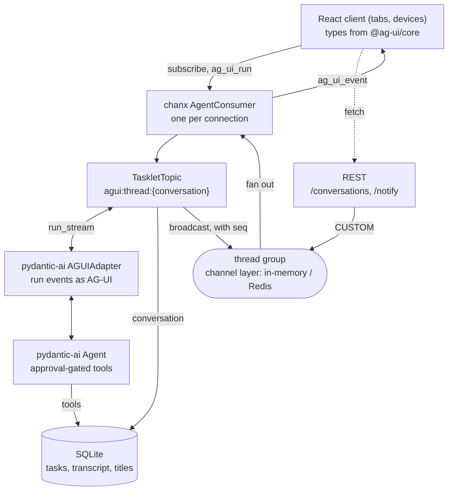

# Architecture

How a prompt becomes a stream of AG-UI events, and how a destructive tool call pauses
for human approval without a protocol of our own.

The shape to notice is how little sits between the agent and the wire. There is no
translation layer: pydantic-ai emits AG-UI events itself, and the topic's job is to
choose a conversation, hand over dependencies, and publish.

## Why there is no harness

`v1` had one — 352 lines translating pydantic-ai's stream into a bespoke message per
event, tracking which tool calls were awaiting approval, and rebuilding transcripts
from stored messages so a reload could render the same cards. All of it is gone,
because the protocol already covers it:

| v1 did this by hand | AG-UI does it |
| --- | --- |
| `text_delta`, `tool_call`, `tool_result` messages | `TEXT_MESSAGE_*`, `TOOL_CALL_*` events |
| `approval_request` + `PENDING_APPROVALS` dict | `RUN_FINISHED` carrying interrupts |
| `tool_decision` message | `resume` on the next run input |
| `history` replay + a transcript builder | the client keeps its own messages |
| `tasks_updated` | `STATE_SNAPSHOT` |

What remains is in `server/app/assistant/`, at 246 lines.

## The agent (`agent.py`)

A plain [pydantic-ai](https://ai.pydantic.dev) agent. Three things matter:

1. **`output_type=[str, DeferredToolRequests]`** — a run ends as text, or as the
   approvals a destructive tool is waiting on. Destructive tools are declared with
   `@agent.tool(requires_approval=True)`; when the model calls one it does *not*
   execute — the run ends early with the pending calls
   ([deferred tools](https://ai.pydantic.dev/tools-toolsets/deferred-tools/)).
   v1 wrapped text in a `TextAnswer` model to carry follow-up chips alongside it;
   AG-UI streams text directly, so the wrapper had no job left.
2. **Every task tool takes `RunContext[AgentDeps]`** and scopes its queries to
   `ctx.deps.conversation_id`, so task lists are per conversation and
   `schedule_reminder` can notify the right thread later.
3. **`build_agent()` is a factory**, so tests and the Playwright app can build the same
   agent against a `FunctionModel`.

Prompting gotcha, unchanged from v1: the instructions tell the model to call
destructive tools directly and **not** ask for confirmation in prose. Without that,
models tend to ask "are you sure?" in chat and bypass the approval flow entirely.

## The topic (`topic.py`)

`TaskletTopic` subclasses the `pydantic-ai-ag-ui` kit and overrides four things:

- **`agent_deps`** — builds `AgentDeps(conversation_id=self.thread_id)`. The thread
  *is* the conversation, so tools are scoped by where the client subscribed.
- **`on_subscribe`** — sends the task list before the kit replays the run in flight, so
  a client joining mid-run applies events on top of state that is already current.
- **`save_history`** — persists, then names the conversation after its first prompt.
- **`send_initial_state`** — adds the task list and any stored chips to the transcript
  the kit already sends, all of it before the run in flight is replayed.
- **`run_events`** — emits `STATE_SNAPSHOT` just before the run's last event. Note it
  fires on `RUN_ERROR` too: a run that raises half way through has still changed the
  task list, and a stale panel is the worse outcome.

## Where the conversation lives (`store.py`)

AG-UI's model is that the client sends the whole message list with every run. This
demo keeps it server-side instead, through the `conversation-store` kit over the
existing `conversations` table.

That is what makes the approval round trip pleasant: resuming carries an interrupt id
and **no messages at all**, because the server already knows what it is resuming.

It is also what restores the paper trail without a protocol of our own. The kit emits
`MESSAGES_SNAPSHOT` on subscribe, converted by `AGUIAdapter.dump_messages` — the same
adapter that writes the live stream knows how to dump stored messages into it, so a
reload renders the same prompts, tool cards and answers. v1 needed a 65-line
transcript builder for this; this app needs none, because replaying a server-held
conversation is every such app's problem, not Tasklet's.

The store holds an opaque string, so one backend serves any agent framework; this kit
converts at the edge with `ModelMessagesTypeAdapter`.

## Broadcast, and joining a run late

`broadcast_run_events = True` sends every run event through the thread's group rather
than down the socket that asked. Two consequences:

1. **The run outlives its connection.** Refreshing mid-answer does not cancel it, and
   every other tab keeps streaming.
2. **Ordering becomes the client's job.** Each event carries a per-run `seq` on the
   chanx envelope — beside the message, not inside the AG-UI payload, so the event
   itself stays standard.

A connection that subscribes mid-run is replayed the run so far, which overlaps with
what is already arriving live. AG-UI has no way to join a stream in progress: a content
delta before its `TEXT_MESSAGE_START` is malformed. So the client applies events in
sequence order, drops what it has already applied, and holds a gap until it fills
(`web/src/lib/ws-client.ts`).

The replay buffer is in-memory in the kit, so this works within a process. Across
instances, broadcast still works but replay does not — a shared `RunEventStore` is the
missing piece.

## Notifications (`notify.py`, `reminders.py`)

AG-UI has no notification event, so they travel as `CUSTOM` with `name:
"notification"` — the protocol's own escape hatch, which a strict client may ignore
without breaking. `emit_to_thread` publishes into a conversation from outside any
connection, which is what lets the HTTP endpoint and the reminder job both reach
clients while holding no socket.

## Testing

Two layers, both without a model provider:

- **`server/tests/`** drives the real consumer through chanx's `WebsocketCommunicator`
  against `FunctionModel`, asserting event sequences, the approval round trip, that
  both tabs see the same `seq`, and that a failed run still publishes its tasks.
- **`web/e2e/`** drives Chromium with Playwright, which starts both servers itself.
  `tests/e2e_app.py` swaps in a scripted model so an assertion never depends on a
  provider's mood. It reads task ids out of a `list_tasks` result rather than assuming
  them — the table counts up across conversations, so the first task is rarely id 1.
